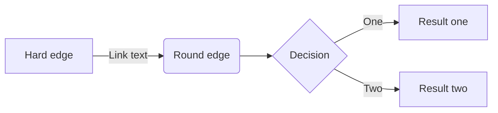

#sdfsad

1. <div class="mermaid">

2. 

   graph LR

3. 

   ​    A --- B

4. 

   ​    B-->C[fa:fa-ban forbidden]

5. 

   ​    B-->D(fa:fa-spinner);

6. 

   </div>

   <div class="mermaid">

   graph LR

   ​    A --- B

   ​    B-->C[fa:fa-ban forbidden]

   ​    B-->D(fa:fa-spinner);

```scheme
graph LR;
A[Hard edge] -->|Link text| B(Round edge)
B --> C{Decision}
C -->|One| D[Result one]
C -->|Two| E[Result two]
```





gitGraph:
options
{
  "nodeSpacing": 150,
  "nodeRadius": 10
}
end
  commit
  branch newbranch
  checkout newbranch
  commit
  commit
  checkout master
  commit
  commit
  merge newbranch


<div class="mermaid">
  graph LR
      A --- B
      B-->C[fa:fa-ban forbidden]
      B-->D(fa:fa-spinner);

    graph LR

A[方形] -->B(圆角)

    B --> C{条件a}
    
    C -->|a=1| D[结果1]
    
    C -->|a=2| E[结果2]
    
    F[横向流程图]
  </div>


<div class="mermaid">
    graph LR

A[方形] -->B(圆角)

    B --> C{条件a}
    
    C -->|a=1| D[结果1]
    
    C -->|a=2| E[结果2]
    
    F[横向流程图]
</div>

```

```

as

ddd

gitGraph:
options
{
  "nodeSpacing": 150,
  "nodeRadius": 10
}
end
  commit
  branch newbranch
  checkout newbranch
  commit
  commit
  checkout master
  commit
  commit
  merge newbranch

```


graph LR

A[方形] -->B(圆角)

    B --> C{条件a}

    C -->|a=1| D[结果1]

    C -->|a=2| E[结果2]

    F[横向流程图]


fas


graph LR;
A[Hard edge] -->|Link text| B(Round edge)
B --> C{Decision}
C -->|One| D[Result one]
C -->|Two| E[Result two]


df
$$
\begin{matrix}
1 & 2 & 3 \\\
4 & 5 & 6 \\\
7 & 8 & 9 \\\
\end{matrix}
\begin{bmatrix}
1 & a_1 & a_1^2 & \cdots & a_1^n \\\
1 & a_2 & a_1^2 & \cdots & a_2^n \\\
\vdots & \vdots & \ddots & \vdots & \vdots \\\
1 & a_n & a_n^2 & \cdots & a_n^n
\end{bmatrix}
$$

a

gitGraph:
options
{
  "nodeSpacing": 150,
  "nodeRadius": 10
}
end
  commit
  branch newbranch
  checkout newbranch
  commit
  commit
  checkout master
  commit
  commit
  merge newbranch


da

​```mermaid
gitGraph:
options
{
  "nodeSpacing": 150,
  "nodeRadius": 10
}
end
  commit
  branch newbranch
  checkout newbranch
  commit
  commit
  checkout master
  commit
  commit
  merge newbranch
​```
```

a  $$ ax_1^2 $$  a


aa 
$$
```
\begin{matrix}
1 & 2 & 3 \\\
4 & 5 & 6 \\\
7 & 8 & 9 \\\
\end{matrix}
$$
$$
ddd
$$
```

aa $ x_1^3 $ $x$

aaaamermaid
  When \(a \ne 0\), there are two solutions to \($ax_1^2$ + bx + c = 0\) and they are
  $$x = {-b \pm \sqrt{b^2-4ac} \over 2a}.$$
  
 


```
