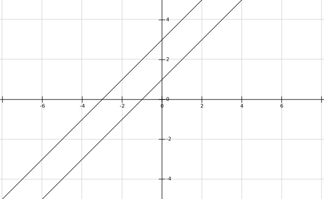

# 概述
## 食品配方问题
甲乙丙丁四种原料营养比如下

|            |   甲        |   乙          |  丙         | 丁 |
|  ----     |   :--:      | :--:       |  :--:    | :--:  |
|   蛋白质%         | 20 | 16 | 10 | 15 |
|    脂肪%        | 3 | 8 | 2 | 5 |
|     碳水化合物%      | 10 | 25 | 20 | 5 |
 做出满足 蛋白质 15%， 脂肪 5%， 碳水化合物 12% 的食品， 求 上述四种原料配比 。

## 解法


###  建立数学模型

设四种原料占该食物的百分比分别为 $x_1$, $x_2$, $x_3$, $x_4$. 则:

$$
\left\{
\begin{array}{}
x_1+x_2+x_3+x_4 = 1 \\
20x_1 + 16x_2 + 10x_3 + 15x_4 = 15  (蛋白质)\\
3x_1 + 8x_2 + 2x_3 + 5x_4 = 5  (脂肪)\\
10x_1 + 25x_2 + 20x_3 + 20x_4 = 12  (碳水化合物)\\
\end{array}
\right.
$$


## 线性方程组解的类型


```flow
result=>operation: 线性方程组解的类型
one=>operation: 有唯一解
multi=>operation: 有多个解
none=>operation: 无解
condA=>condition: 是否有解 ?
condB=>condition: 是否唯一 ?
condC=>condition: 是否合理 ?
approximates=>operation: 找出近似解
property=>operation: 解集的性质
end=>end: 无合理解


result(right)->condA
condA(yes, right)->condB
condB(yes)->one
condB(no)->multi
condA(no)->none
none->approximates

one->condC
multi->condC
condC(yes)->property
condC(no)->end


```


## 线性方程组的类型

```highlight

1. **适定方程组: 存在唯一的解**
2. **欠定方程组: 解不唯一**
3. **超定方程组: 不存在精确解, 可求出近似解**
```


# 线性方程组解的几何意义

## 二元情况

### 唯一解


$$
\left\{
\begin{array}{}
x_1 - x_2 = 1 \\
x_1 + x_2 = 3\\
\end{array}
\right.
$$


### 无解 （直线无交点）

$$
\left\{
\begin{array}{}
x_1 - x_2 = 1 \\
x_1 - x_2 = 3\\
\end{array}
\right.
$$





### 无穷解 （两直线重合）

$$
\left\{
\begin{array}{}
x_1 - x_2 = 1 \\
2x_1 - 2x_2 = 2 \\
\end{array}
\right.
$$


### 超定二元方程的近似解

#### 方程组不相容， 没有精确解

$$
\left\{\begin{matrix}
x_1 & - & x_2 & = & 1 \\
x_1 & + & x_2 & = &3 &  \\
x_1 & + & 2x_2 & = & 5 &
\end{matrix}\right.
$$


## 三元情况

### 适定方程组 （唯一解）

$$
\left\{\begin{matrix}
x+y-z = 4 \\
2x -3y+z=3 \\
-5x+2y-2z=1\\
\end{matrix}\right.
$$

### 消元步骤 （阶梯状）

$ \left\{\begin{matrix}
x&+y&-z = 4 \\
2x& -3y&+z=3 \\
-5x&+2y&-2z=1\\
\end{matrix}\right. $&    ---2,3列消去X---> $ \left\{\begin{matrix}
x&+y& -z = 4  \\
&5y& -3z = 5 \\
&-7y& +7z = -21\\
\end{matrix}\right. $---3列消去Y---> $  \left\{\begin{matrix}
x&+y&-z = 4  \\
&5y& - 3z = 5 \\
&&z = -5\\
\end{matrix}\right.  $

三平面交于一点


### 欠定方程组 （有多个解）
 三平面交于一条直线或者一个平面


### 不相容 无解
三个平面不相交 或者 没有公共点，线，面

```highlight
线性代数和初等代数的区别:借助于矩阵,用计算机解决问题
```
# 高斯消元法

## N元线性方程组


设m为方程数,n为变元数, 则n元方程组可表示为: （n > m）
$$
m组\begin{cases}
a_{11}x_1 + a_{12}x_{2} + \cdots\cdots + a_{1n}x_{n} &= &b_1 \\
a_{21}x_1  +a_{22}x_{2} +\cdots \cdots + a_{2n}x_{n} & = &b_2  \\
\vdots & \\
\vdots &  \\
\underbrace { a_{m1}x_1 + a_{m2}x_{2} +  \cdots\cdots  +  a_{mn}x_{n} = b_m }_{n个}\\
\end{cases} \tag{n元线性方程组}
$$


## 高斯消元法

### 消元过程

通过 同解变换  转换为 阶梯形 同解方程组


### 三种同解变换

位置变换:  交换方程组位置

数乘变换:  方程左右两边 同乘 常数K

消元变换: 方程某元的K倍加到另一个方程上 消掉该元


# 矩阵及矩阵的初等变换

## 矩阵的由来

提取方程组的系数 获得 系数数表  常数数表
$$
A=\begin{bmatrix}
1&2&3\\
4&5&6\\
7&8&9\\
\end{bmatrix}
b=\begin{bmatrix}
1\\
4\\
7\\
\end{bmatrix}
\tag {方程组的系数矩阵和常数矩阵}
$$


## 矩阵的定义

由m x n个数 构成的m行n列的矩形数表
$$
A=\begin{bmatrix}
a_{11}& a_{12} & \dots& a_{1n}\\
a_{21}& a_{22} & \dots& a_{2n}\\
\vdots& \vdots & \ddots&\vdots\\
a_{m1}& a_{m2} & \dots& a_{mn} \\
\end{bmatrix}
\tag {m x n阶矩阵}
$$

## 特殊矩阵

### 行矩阵 :  
$$
A=\begin{bmatrix}
a_1&a_2&... & a_n\\
\end{bmatrix}
$$
### 列矩阵
$$
A=\begin{bmatrix}
a_1 \\

a_2 \\
\vdots \\
a_n \\

\end{bmatrix}
$$


### 同形矩阵
行数 列数相等

### 零矩阵


### n阶方阵

$$
A=\begin{bmatrix}
a_{11}& a_{12} & \dots& a_{1n}\\
a_{21}& a_{22} & \dots& a_{2n}\\
\vdots& \vdots & \ddots&\vdots\\
a_{n1}& a_{m2} & \dots& a_{nn} \\
\end{bmatrix}
\tag {n阶矩阵}
$$


## 特殊矩阵
### 上三角矩阵:
$$
A=\begin{bmatrix}
a_{11}& a_{12} & \dots& a_{1n}\\
0 & a_{22} & \dots& a_{2n}\\
\vdots& \vdots & \ddots&\vdots\\
0& 0 & \dots& a_{nn} \\
\end{bmatrix}
\tag {n阶矩阵}
$$
### 下三角矩阵:
$$
A=\begin{bmatrix}
a_{11}& 0 & \dots& 0\\
a_{21}& a_{22} & \dots& 0\\
\vdots& \vdots & \ddots&\vdots\\
a_{n1}& a_{n2} & \dots& a_{nn} \\
\end{bmatrix}
\tag {n阶矩阵}
$$
### 对角矩阵 $ A_n $

除对角线外全为0
$$
A=\begin{bmatrix}
a_{11}& 0 & \dots& 0\\
0 & a_{22} & \dots& 0\\
\vdots& \vdots & \ddots&\vdots\\
0 & 0 & \dots& a_{nn} \\
\end{bmatrix}
\tag {n阶矩阵}
$$
### 单位矩阵 $ I_n $

对角线全为1的对角阵N阶对角方阵
$$
I =\begin{bmatrix}
1 & 0 & \dots& 0\\
0 & 1 & \dots& 0\\
\vdots& \vdots & \ddots&\vdots\\
0& 0 & \dots& 1 \\
\end{bmatrix}
\tag {n阶方阵}
$$


## 增广炬阵

```highlight
线性方程组可以用增光矩阵表示
```

系数矩阵$ A_n $, 常数项矩阵 b 并列组成的矩阵 C

C = [A, b]

## 矩阵的初等行变换

## 方法

1. 交换两行的位置
2. 某行乘以常数K
3. 把某一行的K倍加到另一行

```highlight
初等行变换是可逆的  称为 同解变换
```


## 两矩阵等价

A 初等行变换 变为B  : A B 等价


# 利用MATLAB解方程组


## 行最简型

Reduced Row Echelon Form

把矩阵化为行最简形

行阶梯矩阵：逐行形成阶梯  

```matlab
ans =
   9    6    2   4
   0    3    8   7
   0    0    5   1
   0   	0    0   7
   0   	0    0   0
```

行最简型
首个不为0的值为1

秩 4

```matlab
   1    6    2   4
   0    1    0   7
   0    0    1   7
   0   	0    0   1
   0   	0    0   0
```

秩 3

```matlab
   1    6    2   4
   0    1    0   7
   0    0    1   7
```

## rref 函数

1. 解线性方程
2. 矩阵的秩  (几行非0)   有几个真正的约束条件
3. 行最简形首元所在的列数

行阶梯矩阵----> 行最简形

例 1


$$
A= \begin{bmatrix}
 2 & -2 & 2 & 6 \\
 2 & -1 & 2 & 4 \\
3 & -1 & 4 & 4 \\
1 & 1 & -1 & 3
\end{bmatrix}   
b = \begin{bmatrix}
-16 \\
-10 \\
-11 \\
-12
\end{bmatrix}
$$


解：

ans = rref([A, b])

```matlab
>> A=[2 -2 2 6; 2 -1 2 4; 3 -1 4 4; 1 1 -1 3]
A =
     2    -2     2     6
     2    -1     2     4
     3    -1     4     4
     1     1    -1     3
>> b=[-16; -10 ; -11; -12]
b =
   -16
   -10
   -11
   -12
>> rref([A,b])
ans =
     1     0     0     0    11
     0     1     0     0    -8
     0     0     1     0    -6
     0     0     0     1    -7
```

最后一列就是方程的解

例 2

判断解的性质和A的秩

```matlab
>> A=[-2 -2  2 2 -2; 1 -5 1 -3 -1; -1 2 -5 6 5; -1 2 1 0 -1]
A =
    -2    -2     2     2    -2
     1    -5     1    -3    -1
    -1     2    -5     6     5
    -1     2     1     0    -1
>> b = [-2; -1; 2 ; 0]
b =
    -2
    -1
     2
     0
>> rref([A,b])
ans =
    1.0000         0         0         0         0   -0.2222
         0    1.0000         0         0         0    0.2222
         0         0    1.0000         0   -1.0000   -0.6667
         0         0         0    1.0000         0   -0.3333
```

故欠定 有无穷解  秩为4

ip = 1 2 3 4   不为0的首元


# 应用实例

##

## 平板材料温度问题

```matlab
>> A = [1 0 0 0; 1 1 1 1; 1 2 4 8; 1 3 9 27]
A =
     1     0     0     0
     1     1     1     1
     1     2     4     8
     1     3     9    27
>> b = [3 ; 0; -1; 6]
b =
     3
     0
    -1
     6
>> rref([A,b])
ans =
     1     0     0     0     3
     0     1     0     0    -2
     0     0     1     0    -2
     0     0     0     1     1
```


## 交通节点车流量问题

## 化学式配平问题

```matl
>> A = [3 0 -1 0; 8 0 0 -2; 0 2 -2 -1]
A =
       3              0             -1              0       
       8              0              0             -2       
       0              2             -2             -1       
>> b = [0; 0; 0]
b =
       0       
       0       
       0       
>> format rat, rref([A,b])
ans =
       1              0              0             -1/4            0       
       0              1              0             -5/4            0       
       0              0              1             -3/4            0    
```


```highlight
1. 了解二，三阶线性方程组的图形和几何意义
2. 利用初等变换把 增广矩阵 转化为 行最简形
3. 秩表明独立方程的个数
4. 系数矩阵和增广矩阵的秩相等是线性方程组有解的充分必要条件
```
