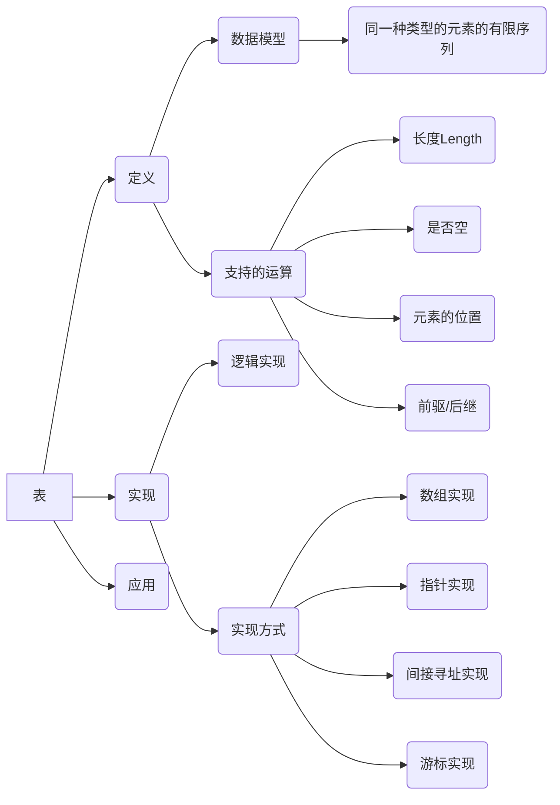

ADT表

## 定义

```mermaid
graph LR;
A[表] --> B(定义)
B --> C(数据模型)
C-->M(同一种类型的元素的有限序列)
B-->D(支持的运算)
D-->N(长度Length)
D-->O(是否空)
D-->P(元素的位置)
D-->Q(前驱/后继)
A -->E(实现)
E-->G(逻辑实现)
E-->H(实现方式)
H-->I(数组实现)
H-->J(指针实现)
H-->K(间接寻址实现)
H-->L(游标实现)
A-->F(应用)
```

