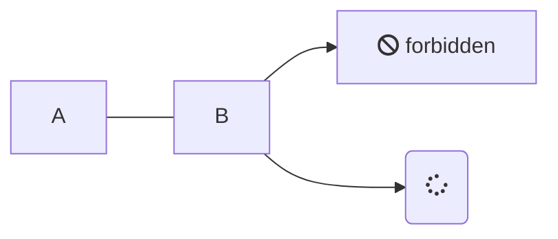
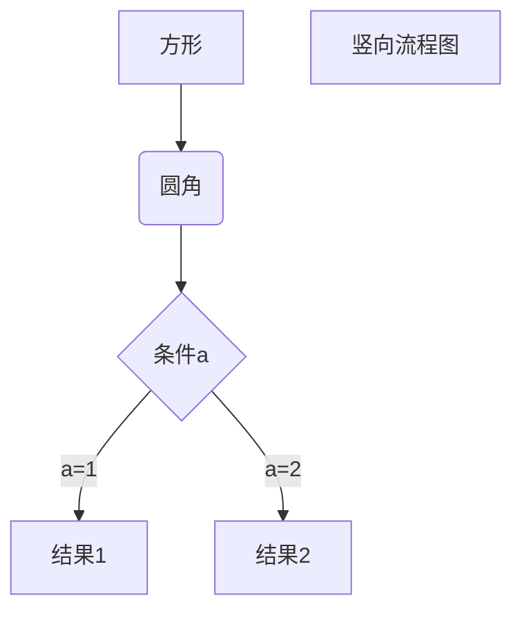

# 概述
eg： 食品配方问题
甲乙丙丁四种原料营养比如下

|            |   甲        |   乙          |  丙         | 丁 |
|  ----     |   :--:      | :--:       |  :--:    | :--:  |
|   蛋白质%         | 20 | 16 | 10 | 15 |
|    脂肪%        | 3 | 8 | 2 | 5 |
|     碳水化合物%      | 10 | 25 | 20 | 5 |
 做出满足 蛋白质 15%， 脂肪 5%， 碳水化合物 12% 的食品， 求 上述四种原料配比 。


# 解法
\begin{matrix}
   a & b \\
   c & d
\end{matrix}

When $a \ne 0$, there are two solutions to `\(ax^2 + bx + c = 0\)` and they are:
$$x = {-b \pm \sqrt{b^2-4ac} \over 2a}$$

##  建立数学模型

设四种原料占该食物的百分比分别为  $x_1$, $x_2$, $x_3$, $x_4$. 则:
$$\sum_{i=0}N\int_{a}{b}g(t,i)\text{d}t$$
$$
\begin{cases}
a_1x+b_1y+c_1z=d_1 \\ 
a_2x+b_2y+c_2z=d_2 \\ 
a_3x+b_3y+c_3z=d_3
\end{cases}
$$
$$

$$
\left\{ 
\begin{array}{ll} 
x_1+x_2+x_3+x_4 = 1 \\ 
20x_1 + 16x_2 + 10x_3 + 15x_4 = 15  (蛋白质)\\ 
3x_1 + 8x_2 + 2x_3 + 5x_4 = 5  (脂肪)\\ 
10x_1 + 25x_2 + 20x_3 + 20x_4 = 12  (碳水化合物)\\ 
\end{array}
\right.
$$

$$
x = {-b \pm \sqrt{b^2-4ac} \over 2a}.
$$

$$
\mathbf{V}_1 \times \mathbf{V}_2 =  \begin{vmatrix}
\mathbf{i} & \mathbf{j} & \mathbf{k} \\
\frac{\partial X}{\partial u} &  \frac{\partial Y}{\partial u} & 0 \\
\frac{\partial X}{\partial v} &  \frac{\partial Y}{\partial v} & 0 \\
\end{vmatrix}
$$
解得:


---

### 线性方程组解的类型





1. <div class="mermaid">

2. 

   graph LR

3. 

   ​    A --- B

4. 

   ​    B-->C[fa:fa-ban forbidden]

5. 

   ​    B-->D(fa:fa-spinner);

6. 

   </div>

   ```flow      //开头是英文状态下的三个顿号
   st=>start: 开始
   op=>operation: 我的操作
   cond=>condition: 确认?
   e=>end:结束
   ```

```mermaid
graph LR

A[方形] -->B(圆角)

​    B --> C{条件a}

​    C -->|a=1| D[结果1]

​    C -->|a=2| E[结果2]

​    F[横向流程图]
```


\```

dddd




graph TD

A[方形] -->B(圆角)

​    B --> C{条件a}

​    C -->|a=1| D[结果1]

​    C -->|a=2| E[结果2]

​    F[竖向流程图]

\```

<font color=red size=5>

1. 适定方程组: 存在唯一的解
2. 欠定方程组: 解不唯一
3. 超定方程组: 不存在精确解, 可求出近似解
</font>


