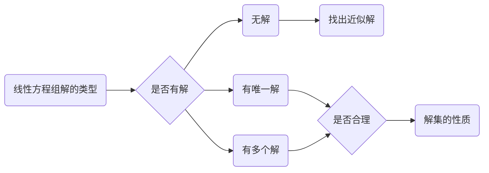
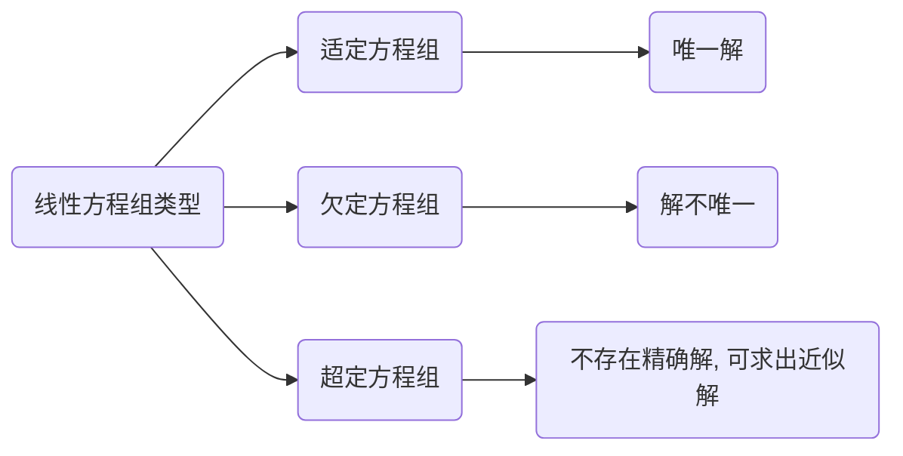

## 食品配方问题
甲乙丙丁四种原料营养比如下

|             |  甲  |  乙  |  丙  |  丁  |
| ----------- | :--: | :--: | :--: | :--: |
| 蛋白质%     |  20  |  16  |  10  |  15  |
| 脂肪%       |  3   |  8   |  2   |  5   |
| 碳水化合物% |  10  |  25  |  20  |  5   |
 做出满足 蛋白质 15%， 脂肪 5%， 碳水化合物 12% 的食品， 求 上述四种原料配比 。

## 解法

###  建立数学模型

设四种原料占该食物的百分比分别为 $x_1$, $x_2$, $x_3$, $x_4$. 则:

$$
\begin{Bmatrix}
 x_1+&  x_2+&  x_3+&  x_4=&  1  &  （总含量）&\\\\ 
 20x_1 +& 16x_2 + & 10x_3 + &  15x_4 =  & 15  & (蛋白质)&\\\\ 
 3x_1 + & 8x_2 + & 2x_3 + & 5x_4 =  &  5  & (脂肪)&\\\\ 
 10x_1 +&  25x_2 + &   20x_3 + & 20x_4 = &  12  & (碳水化合物)&
\end{Bmatrix}.
$$

## 线性方程组解的类型

## 线性方程组的类型

