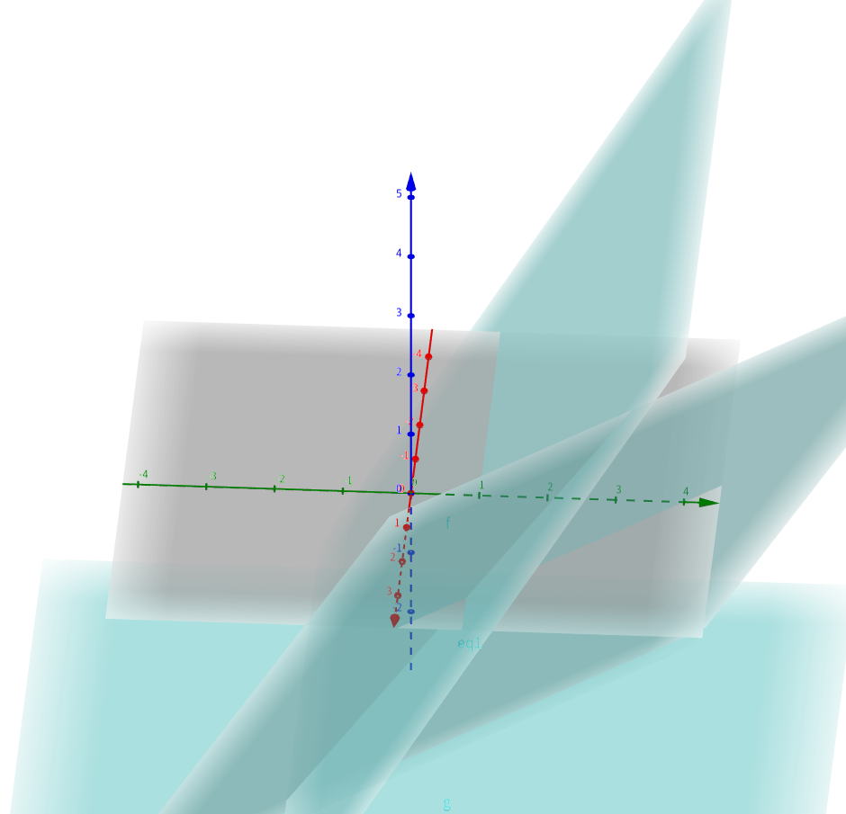
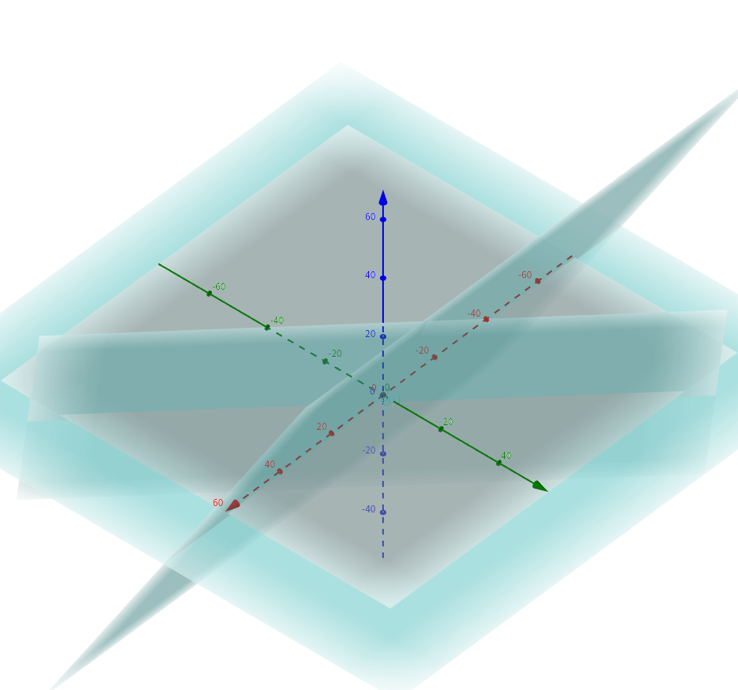

## 二元情况

### 唯一解

$$
\begin{Bmatrix}
 x_1 -  &   x_2 =  &1 \\\\ 
x_1 + & x_2 =  & 3
\end{Bmatrix}
$$


### 无解 （直线无交点）


$$
\begin{Bmatrix}
x_1-  & x_2 = &1  \\\\ 
x_1 - &x_2 =  & 3 
\end{Bmatrix}
$$


### 无穷解 （两直线重合）

$$
\begin{Bmatrix}
x_1-  & x_2 = &1  \\\\ 
2x_1 - &2x_2 =  & 2 
\end{Bmatrix}
$$


### 超定二元方程的近似解
```
方程组不相容， 没有精确解
```
$$
\begin{Bmatrix}
x_1 -  & x_2 = &1  \\\\ 
x_1 +  & x_2 = &3  \\\\ 
x_1 + &2x_2 =  & 5 
\end{Bmatrix}
$$


## 三元情况

### 适定方程组 （唯一解）
$$
\begin{Bmatrix}
x_1 -  & x_2 = &1  \\\\ 
x_1 +  & x_2 = &3  \\\\ 
x_1 + &2x_2 =  & 5 
\end{Bmatrix}
$$
$$
\left\{\begin{matrix}
x+y-z = 4 \\
2x -3y+z=3 \\
-5x+2y-2z=1\\
\end{matrix}\right.
$$

### 消元步骤 （阶梯状）

$ \left\{\begin{matrix}
x&+y&-z = 4 \\
2x& -3y&+z=3 \\
-5x&+2y&-2z=1\\
\end{matrix}\right. $&    ---2,3列消去X---> $ \left\{\begin{matrix}
x&+y& -z = 4  \\
&5y& -3z = 5 \\
&-7y& +7z = -21\\
\end{matrix}\right. $---3列消去Y---> $  \left\{\begin{matrix}
x&+y&-z = 4  \\
&5y& - 3z = 5 \\
&&z = -5\\
\end{matrix}\right.  $

三平面交于一点




### 欠定方程组 （有多个解）
 三平面交于一条直线或者一个平面




### 不相容 无解
三个平面不相交 或者 没有公共点，线，面

```highlight
线性代数和初等代数的区别:借助于矩阵,用计算机解决问题
```